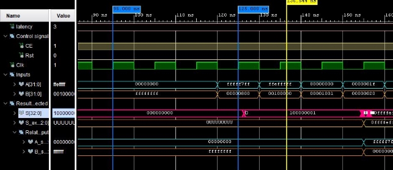

**ONICA ALEXANDRU VALENTIN   s267561 Specification and Simulation of Digital Systems**   

**Report assignment: unsigned 32-bits Subtracter** 

Given the impossibility of generating all 264 possible input combinations, I wanted to focus on a small set of problems, for a total of 162 test vectors: 

- The four combinations between all 1s and 0s. 
- The capability of clearing each output bit, subtracting 2n (n from 0 to 31) to itself. 
- The capability of reaching the simple result of -1 subtracting 2n – 1 to 2n to check the correct behaviour of the *borrow in* bit, represented by the *carry out port* in subtraction mode. However, it has not been included in the *IP core* because as stated in the IP documentation for an output of width “*Max(A Input Width, B Input Width)* + 1” (33 bits), the *carry out port* is not available, or more precisely not needed since , even if it generates the correct result, it corresponds to S(32) or 
S(32) , where S is the result written in 2’s complement format, depending on the configured polarity. 
- The capability of generating the *A Input* corresponding negative value. 
- The *borrow in* ability of each singular bit, for example “110111” – “001000”. 
- The cascaded *borrow in* ability starting from 231, for example 231 – “011”. 

The input vectors have been generated using a python script created ad-hoc by me, and since most of the sequences have the same result, I shuffled them to increase the switching activity on the output register.

My IP has this structure, having the Clock Enable (CE) signal active till the last computation and the System Clear signal (SCLR) substituted by a synchronous reset in the testbench. 
I also added a constraints file for the Clock signal to get valid timing and power summaries in the implementation. 

My testbench requires VHDL-2008 (this has already been handled in the tcl script) and it is based on 4 processes: 

- *Clkproc*: 100Mhz clock signal generator 
- *read\_in\_proc*: sets all the other input signals during the falling edge of the Clock, since the IP reads *A* and *B* on the rising edge, guaranteeing good setup and hold times.  
An initial reset, *“A <= (others=>'0'); B <= (others=>'1');”* to differ from the all zeros outputs of the Subtracter and check when the IP is actually active and waits* 12 clock cycles before setting the inputs vectors. 

- *read\_out\_proc*: it waits for the 12 clock cycles plus the latency before comparing the expected result with the produced one. This operation is also performed on the falling edge.  
In the report I used “*to\_hstring*” which is a function required to convert a *std\_logic\_vector* into a hexadecimal format string, present only in the VHDL-2008 standard. In case of operational error, it prints in the console which inputs caused it and what was the result of the Subtracter respect to the expected one. 

- *savein*: I chose to create an *array (0 to latency-1) of std\_logic\_vector(31 downto 0)* type used to shift in the input vectors, in *a\_v* and *b\_v* for A and B vectors respectively, in order to display in the simulation which inputs generated that result, since there is a delay. 
I could also assign “transport ‘input’ after *10 x latency*” to a signal, but the RAM usage increase using an array is not significant.  

But why 12 clock cycles?  

As we can see from the post-timing simulation, to generate the first valid output after the power-up it takes up to 125ns, the first rising edge of the Clock is at 5ns so 120ns. Given that it has a 3 periods latency, the IP starts reading the inputs only at 95 ns, after 9 clock periods. So, I could also wait for 9 clock cycles before starting the actual verification, but in order to display this matter, I preferred 12. 

The latency signal is a constant that generalises the latency choice of the IP. In the tcl script there are 4 available pre-written configurations, and when changing the configurations also the latency constant must be changed accordingly. 

The duration of the testbench is handled in the tcl script by the expression at line 61 and set at line 62. It is equal to   *initial delay 120ns + final delay 30ns + Period 10ns \*(latency + #tests 162)* 

What happens to resource usage and timing in Fabric and DSP48 implementation? 

Obviously, the input/output usage is the same, given that the IP ports have not been changed. Instead, while in the fabric implementation we need a set of look-up tables, flip-flops and a BUFG (global clock buffer with high fan-out to reach all the components), in the DSP48 one only 1 of 220 DSP blocks is used. It is an ALU embedded into the fabric of the FPGA, which contains a chain of add/subtract, multiplier units connected to an add/subtract/accumulate engine. 

In the DSP48, the timing engine does not show the paths internal to the block and with no constraints assigned it is not performed on setup and hold slack, while the worst pulse width slack is nearly doubled, from 4.02 ns to 7.846 ns leaving a greater margin for clock improvement. 
